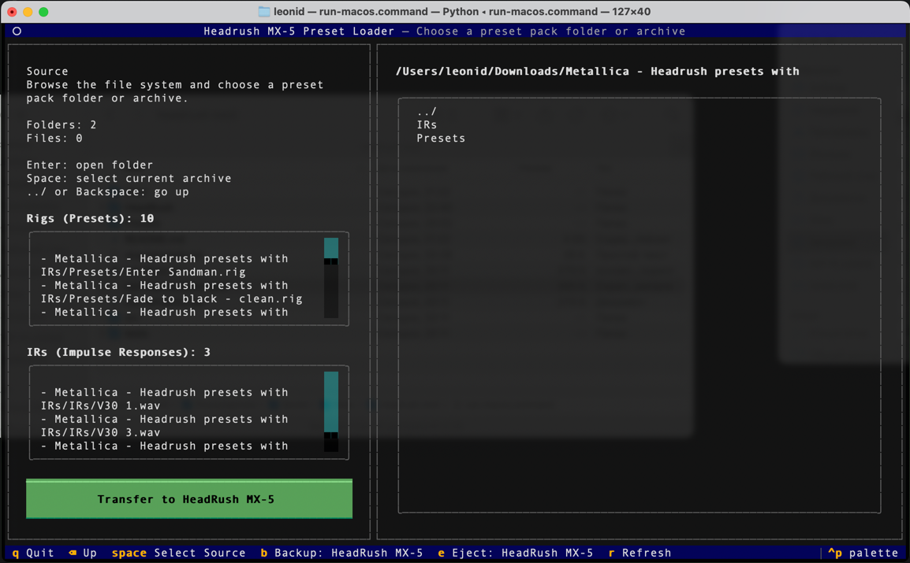
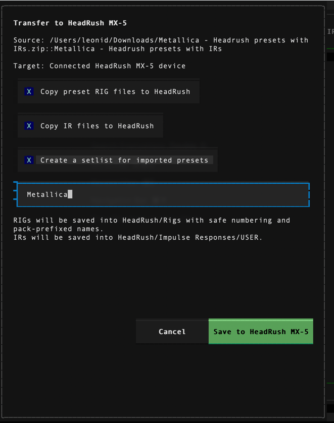
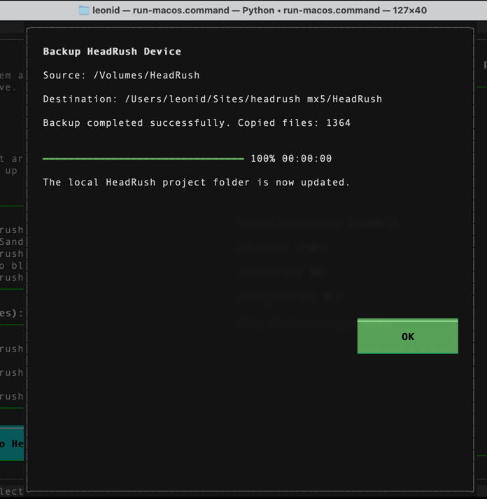
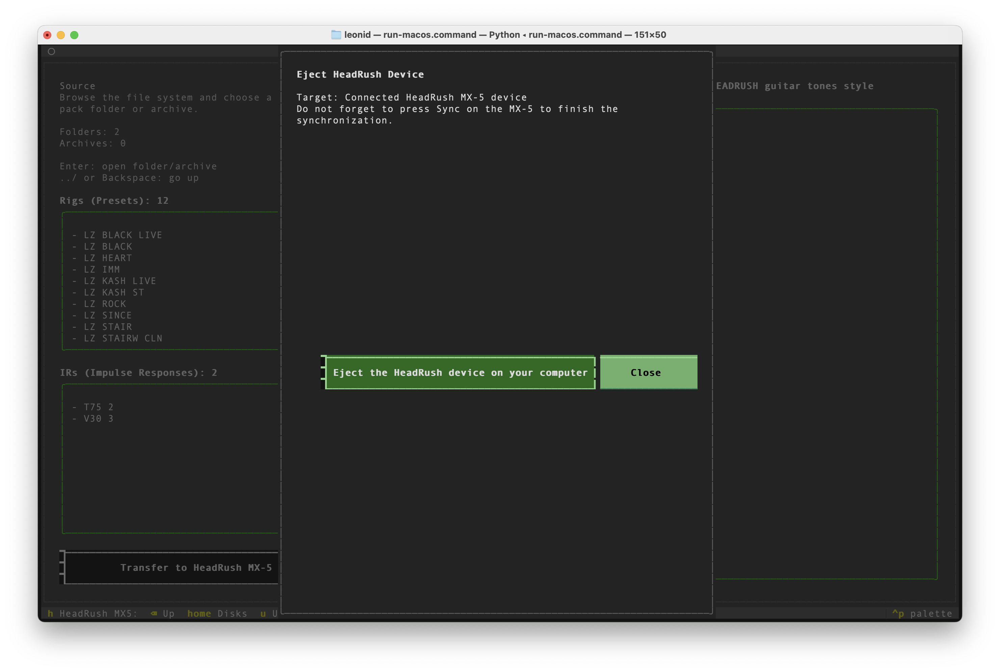

# headrush-mx5

Terminal application for browsing HeadRush MX-5 preset packs and transferring them to a connected HeadRush MX-5 device or to a local sample `HeadRush/` folder.

The application can:

- browse disks and mounted volumes;
- open preset pack folders;
- open `.zip` and `.rar` archives without manual extraction;
- analyze `.rig` presets and `.wav` impulse responses;
- transfer presets and IRs to a HeadRush MX-5 target structure;
- create a `.setlist` file for imported presets;
- detect a mounted `HeadRush` USB Transfer volume;
- back up a connected HeadRush device into the local project `HeadRush/` folder;
- eject the connected device and remind you to press `Sync` on the hardware.

## Quick Start

### macOS

Open `run-macos.command`.

### Linux

```bash
./run-linux.sh
```

### Windows

Open `run-windows.bat`.

The launch scripts create a local `.venv`, install dependencies from `requirements.txt`, and start the application.

## Controls

- `↑` / `↓` - move through the list
- `Enter` - open a folder or open a browsable archive (`.zip`, `.rar`)
- `../` - first list item inside any folder or archive, moves up one level
- `Space` - select the current folder, or select the highlighted archive source
- `Backspace` - go up one level
- `Home` - return to the disks/roots screen
- `b` - back up the connected HeadRush device
- `e` - eject the connected HeadRush device
- `r` - refresh the current view
- `q` - quit

The `Transfer`, `Backup`, and `Eject` actions are shown only when a `HeadRush` USB Transfer volume is connected.

## Workflow

### 1. Browse a preset pack and inspect its content

Open a folder or archive and review the detected presets and impulse responses in the left panel.



### 2. Open the transfer options

Use `Transfer to HeadRush MX-5` to open the transfer dialog.  
By default the dialog enables:

- copying `.rig` presets;
- copying `.wav` IR files;
- creating a setlist for the imported presets.

The default setlist name is taken from the current folder or archive name and is shown in uppercase in the dialog.



### 3. Back up the connected device

Use `Backup: HeadRush MX-5` from the footer to mirror the currently connected device into the local project `HeadRush/` folder.



### 4. Eject and sync

When file transfer is finished, use `Eject: HeadRush MX-5` from the footer.

Do not forget to press `Sync` on the MX-5 after ejecting the drive. This finalizes the synchronization on the hardware side.



### 5. Undo the current session

Use `Undo Session` from the footer to remove the presets, IRs, and setlist changes created by transfers during the current app session. The app asks for confirmation before restoring the previous setlist contents and deleting the created files.

## Transfer Rules

### RIG files

- Target folder: `HeadRush/Rigs`
- Imported RIGs are renumbered starting from `300`
- Existing numbers are skipped automatically
- Imported RIG names receive a pack-based prefix when useful
- Existing RIG filenames are never overwritten

### IR files

- Target folder: `HeadRush/Impulse Responses`
- IRs found in a named folder inside the source pack keep that folder name on the HeadRush target
- IRs found at the source root are copied to `HeadRush/Impulse Responses/USER`
- If an IR with the same name already exists on the HeadRush target, it is reused and not copied again
- Imported presets are rewritten to point at the final HeadRush IR folder and IR file name
- If a preset depends on an IR that is missing on the target and IR copy is disabled, transfer stops with an error instead of creating a broken preset

### Setlists

- Target folder: `HeadRush/Setlists`
- Setlists are saved as `.setlist` JSON files
- A generated setlist contains the imported rig IDs and rig names
- If a setlist with the same name already exists, new imported rigs are appended to it instead of creating a replacement copy

## HeadRush Device Detection

- The app looks for a mounted volume named `HeadRush`
- On macOS and Linux, it checks mounted volumes such as `/Volumes/HeadRush`
- On Windows, it checks drive volume labels
- When the device is connected, footer actions for `Transfer`, `Backup`, and `Eject` become available

## State Persistence

- The browser remembers the last opened folder
- If the previous session ended inside a browsable archive, the archive path and internal archive folder are restored too
- State is stored in `.headrush-mx5-state.json`

## Repository Structure

- `src/headrush_mx5/` - application code
- `tests/` - tests for browser, archive, state, and transfer logic
- `docs/images/` - screenshots used in the GitHub README
- `run-macos.command`, `run-linux.sh`, `run-windows.bat` - startup scripts
